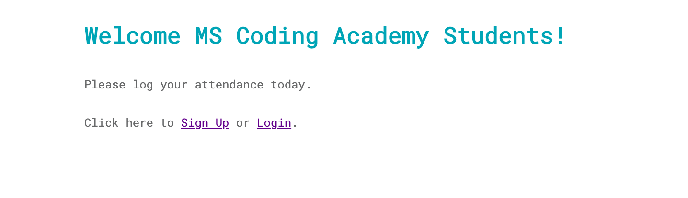
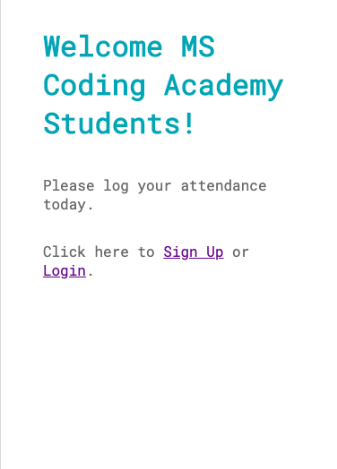

# KikiSaver 

The following project is an attendance tracker app built during the Mississippi Coding Academy back-end programming course. The user creates a user to store in the database, then is allowed to login with a selfie image submission. 

A group of about seven night students built the app while working remotely. The team is continually adding features including recognition of the users' geolocation prior to login at the Academy's IP address.

## Screenshots

### _Landing Page_
*Desktop Landing*



*Mobile Landing*



## Installation

Node JS and npm must be installed

An instance of MySQL must be running

### `sudo mysql -uroot -p`

login in to your root username and leave this running.

Open another bash terminal at the cloned KikiSaver directory.

### `npm install`

Install will pull in all required dependencies.

Next you must create your own copy of .env with the following code and insert your own user name and password:

```
export DB_USER=''
export DB_PASS=''    
```

Review the init.sql and confirm that your localhost username and password match your .env username and password variables.

Next return to your instance of MySQL.

### `source init.sql`

The queries should each return back 'OK'.

### `source .env`

Run this command, so app.js will connect correctly to your username and password variables.

### `node app.js`

Runs the app in the development mode.<br>
Open [http://localhost:3000](http://localhost:3000) to view it in the browser.

## Requirements

1. ~MSCoding not have to take roll~
2. Fairly robust to cheating
3. Class learns about full stack development
4. Send device GPS and IP
5. email === username
6. Password and selfie and time for verification
7. Admin account to view attendance, edit/delete records


### Users
|id|username|password|first_name|last_name|phone|created_at|deleted_at|
|--|--------|--------|----------|---------|-----|----------|----------|
|||||||||

### Attendance
|id|user_id|created_at|deleted_at|gps|selfie_url|ip|
|--|--------|--------|----------|---------|-----|----------|
||||||||


## Technologies Used

### Languages and Frameworks
		* HTML5
		* CSS3
		* JS
   
### API (none used)

## Photos
		* Courtesy of ...

Please offer report any feedback to me via Pull Request @leviking.

Thanks for reading thus far!


